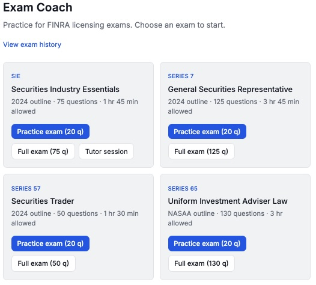
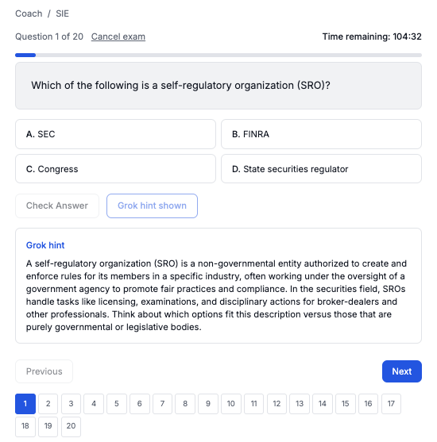

# Trusted Advisor

Trusted Advisor is an AI-powered coaching platform for financial exam prep and professional decision support. It combines expert personas, live intelligence, and structured practice workflows to help people learn faster, make better decisions, and perform with confidence.

---

## Why teams and learners use Trusted Advisor

- **Faster exam readiness** with guided practice for SIE, Series 7, Series 57, and Series 65.
- **Higher confidence under pressure** through timed exam simulation and instant explanations.
- **Smarter learning loops** with progress history, score trends, and targeted improvement.
- **Scalable enablement** for firms that need consistent, high-quality training outcomes.
- **Always-on support** so users can practice, ask questions, and refine understanding anytime.

---

## Core features

- **AI Chat with expert personas**  
  Interact with finance-focused advisors tailored to different goals and communication styles.

- **Persona-specific knowledge context**  
  Attach structured reference content to personas so responses can use role-specific context.

- **Exam Coach experience**  
  Run realistic practice sessions and full exams with immediate correctness checks and explanations.

- **Tutor mode for focused study**  
  Launch guided coaching flows that adapt to weak areas and reinforce key concepts.

- **Progress tracking**  
  Review performance over time, identify gaps, and prioritize next study actions.

---

## Business impact

- **Reduce failure-related cost** from repeated exam attempts and delayed productivity.
- **Accelerate onboarding** for new advisors and licensed roles.
- **Standardize training quality** across teams, cohorts, and locations.
- **Improve retention** with clear milestones and measurable progress.

---

## Product snapshot

Trusted Advisor is built for outcomes: better preparation, better decision quality, and better performance at scale.
